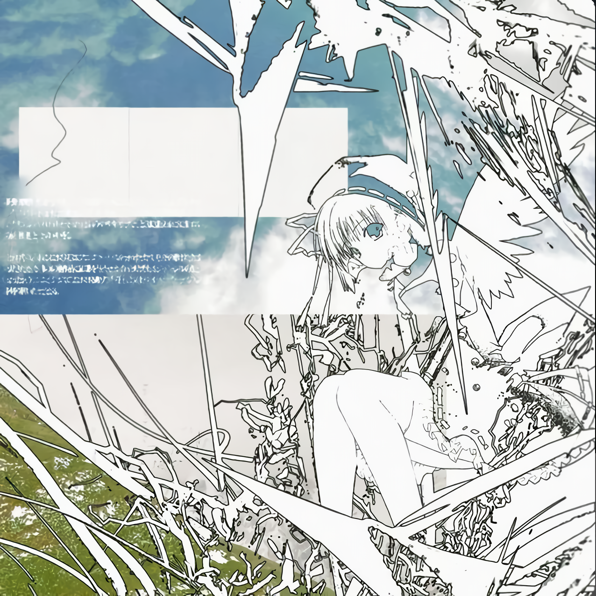
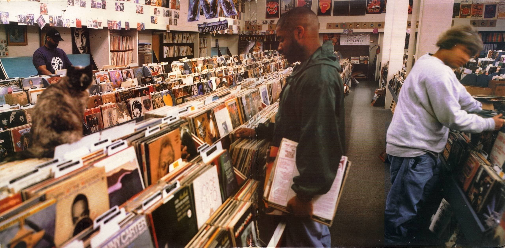

# MiguelAngel861 👋

My name is Miguel Angel Scott, and I love music, read manga and do programming stuff. I always try to do my best

🌱 I’m still learning Python  
🔭 I’m currently working on BareDo 

 

## 💻 Tech Stack

<!-- Lenguajes -->

 

<!-- Frameworks / Tecnologías -->

 

<!-- Herramientas / Versionamiento -->

 

## 📊 GitHub Stats:

    

  

---

  

    <i>"add some text here"</i>
  

  
  

  
